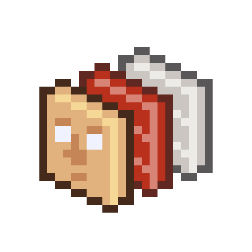

# 16-Bit Anatomy

<div align="center">
  
  
  **An interactive retro-style anatomy viewer**
  
  *Explore the human body through pixelated layers*
</div>

## ✨ Features

- 🎮 **Retro Aesthetic**: 16-bit inspired visual style with pixel-perfect textures
- 🔍 **Interactive Layer System**: Toggle between skin, muscle, skeleton, bone, and organ layers
- 📱 **Cross-Platform**: Works on desktop, mobile
- 🎯 **Educational**: Detailed anatomical information with interactive hotspots
- 🎨 **Modern Tech Stack**: Built with React Three Fiber and Three.js

## 🚀 Quick Start

### Prerequisites

- Node.js (version 14.18+ or 16+)
- npm, yarn, or pnpm
- Modern web browser with WebGL support

### Installation

1. **Clone the repository:**

   ```bash
   git clone https://github.com/yourusername/16-bit-anatomy.git
   cd 16-bit-anatomy
   ```

2. **Install dependencies:**

   ```bash
   npm install
   # or
   yarn install
   # or
   pnpm install
   ```

3. **Start the development server:**

   ```bash
   npm run dev
   # or
   yarn dev
   # or
   pnpm dev
   ```

4. **Open your browser:**
   ```
   http://localhost:5173
   ```

## 🎮 How to Use

### Desktop Controls

- **Mouse**: Click and drag to rotate the model
- **Scroll**: Zoom in/out
- **Click on body parts**: View detailed information
- **Layer Controls**: Use the sidebar to toggle between anatomical layers

### Layer System

Navigate between different anatomical layers:

- **Skin**: Outer skin layer with texture details
- **Muscle**: Muscular system with individual muscle groups
- **Skeleton**: Complete skeletal structure
- **Bone**: Individual bone components
- **Organs**: Internal organ systems

## 🛠️ Tech Stack

- **Frontend**: React 19 + TypeScript
- **3D Engine**: Three.js + React Three Fiber
- **UI**: ShadCN + Tailwind CSS
- **State Management**: Zustand
- **Build Tool**: Vite

## 🤝 Contributing

1. Fork the repository
2. Create a feature branch (`git checkout -b feature/amazing-feature`)
3. Commit your changes (`git commit -m 'Add amazing feature'`)
4. Push to the branch (`git push origin feature/amazing-feature`)
5. Open a Pull Request

## 📄 License

This project is licensed under the MIT License - see the [LICENSE](LICENSE) file for details.

## 🙏 Acknowledgments

- Medical illustrations and anatomical data
- Three.js community for excellent 3D web development tools
- React Three Fiber ecosystem for React integration
- Retro gaming aesthetic inspiration

---

<div align="center">
  Made with ❤️ for educational purposes
</div>
